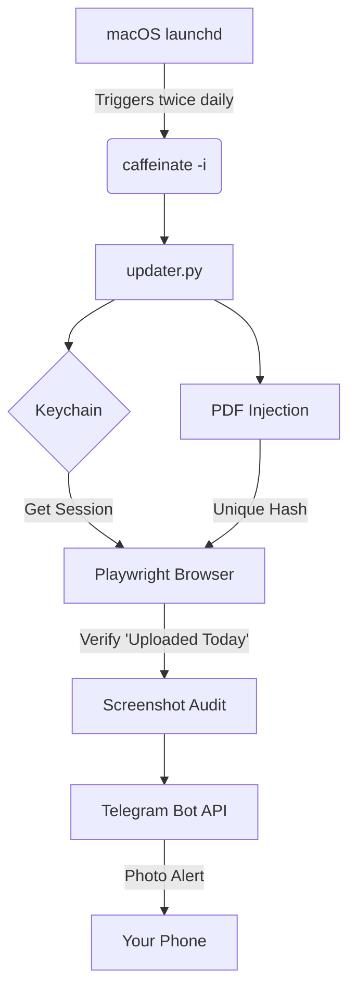

# 🛡️ Naukri CareerGuard

**CareerGuard** is a stealthy, local-first automation tool designed to keep your Naukri profile at the absolute top of recruiter search results. It uses dynamic PDF injection to satisfy the "last updated" algorithm without visual changes to your resume.

---

## ✨ Key Features

- **🚀 Algorithm Optimizer:** Injects invisible timestamps into your PDF to ensure every upload has a unique file hash.
- **🕵️ Stealth Mode:** Runs locally on your Mac using your residential IP and real browser fingerprint.
- **📱 Visual Proof:** Sends a full-page screenshot of your updated profile directly to your phone via Telegram.
- **🛡️ Bulletproof Resilience:** 
    - macOS `Keychain` integration (No plaintext passwords).
    - `caffeinate` ensures the script finishes even if the Mac tries to sleep.
    - Persistent Circuit Breaker (halts after 3 consecutive failures).

---

## 🛠️ System Architecture



---


## 🌍 Portability & Public Use
This project is built to be **portable**. 
- **No Hardcoded Paths:** The script dynamically detects its folder location, making it easy to clone and run on any Mac.
- **Generic Output:** Generated resumes are named `Resume_Updated_MonthYear.pdf` by default for a clean, professional look that works for anyone.

## 🚀 Quick Setup Guide

### 1. Prerequisites
- **macOS** (Optimized for Sequoia/Sonoma)
- **Python 3.11+**
- **Telegram Bot Token** (From @BotFather)

### 2. Installation
```bash
# Clone the repo
git clone https://github.com/your-username/naukri-careerguard.git
cd naukri-careerguard

# Build the environment
python3 -m venv venv
source venv/bin/activate
pip install -r requirements.txt
playwright install chromium
```

### 3. Secure Credentials
Run the setup script once to log in manually and save your session to the macOS Keychain.
```bash
python3 auth_setup.py
```

### 4. Enable Auto-Wake
To allow the script to wake your Mac from sleep, run `sudo visudo` and add:
`YOUR_USERNAME ALL=(ALL) NOPASSWD: /usr/bin/pmset`

### 5. Deployment
Copy the provided `.plist` to your LaunchAgents folder to start the 10:30 AM / 3:30 PM schedule:
```bash
cp com.naukri.careerguard.plist ~/Library/LaunchAgents/
launchctl load -w ~/Library/LaunchAgents/com.naukri.careerguard.plist
```

---

## 📂 Project Structure
- `updater.py`: Core logic for PDF injection, navigation, and notification.
- `auth_setup.py`: Utility to capture secure session state.
- `master_resume.pdf`: Your base resume (Do not rename).
- `audit/`: Folder containing success/error screenshots (Protected).
- `state.db`: SQLite database for circuit breaker and tracking.

---

## ⚠️ Privacy & Security
- **Never commit your `master_resume.pdf` to a public repo.** Keep this repository **PRIVATE**.
- Screenshots in the `audit/` folder contain Personal Identifiable Information (PII).
- Credentials are never stored in plaintext; they reside in your native macOS Keychain.
